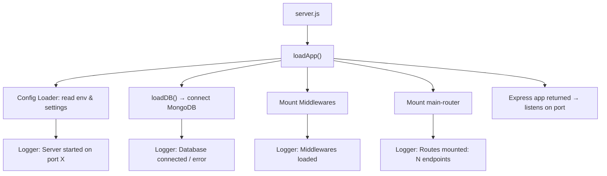

# **ARCHITECTURE**

## ***1. Purpose***
This document describes the structure and startup flow of this Node + Express API using modular bootstrapping, environment config, and centralized logging.

## ***2. Core Files***

| File | Responsibility |
|------|----------------|
| `src/loaders/app.js` | Bootstraps Express app (middlewares + routes) |
| `src/loaders/config.js` | Loads environment configuration |
| `src/loaders/db.js` | Connects to MongoDB |
| `src/server.js` | Entry point — starts the server |
| `src/routes/main-router.js` | Central router mounting all endpoints |
| `src/utils/logger.js` | Winston logger instance and wrappers |


## ***3. Folder Structure***

```

src/
├─ loaders/
│   ├─ app.js
│   ├─ config.js
│   └─ db.js
├─ routes/
│   └─ main-router.js
├─ utils/
│   └─ logger.js
├─ server.js

```

---

## 4. Startup Flow


---

## ***5. Config Management***

- Supports multiple environment files:
  - `.env.local`
  - `.env.dev`
  - `.env.prod`
- `config.js` selects and exposes structured config (port, DB URI, etc.)
- Prevents scattering `process.env` reads throughout the codebase.

---

## ***6. Logger (Winston)***

- Centralized logger for consistent logs.
- Logs key lifecycle events:
  - Server start with port
  - Database connection outcome
  - Middleware load
  - Route mount count
- Configurable log levels help debugging.

---

## ***7. Layered Request Flow***

```

Client → Route → Controller → Service → Repository → Database

```

---

## ***8. Why This Architecture***

- **Separation of concerns:** each layer has a specific job.
- **Modular bootstrapping:** loaders initialize subsystems in order.
- **Config isolation:** environment config per deployment stage.
- **Centralized logging:** consistent and structured startup and runtime logs.

---