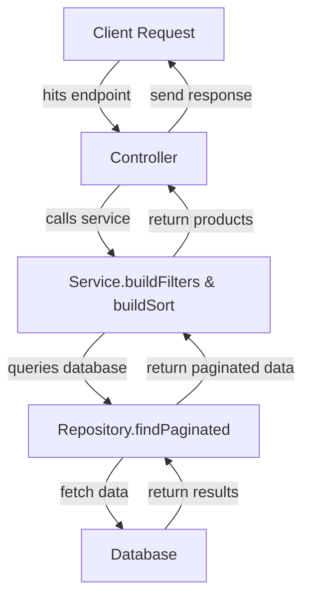

# **QUERY ENGINE DOC**

## **1. Overview**

This document explains the query engine used in the Product API, including dynamic filtering, sorting, pagination, and soft delete handling. The query engine is implemented in `ProductService` (`buildFilters` and `buildSort`).

---

## **2. Filter Engine (`buildFilters`)**

### **2.1 Base Filter**

* All queries by default exclude soft-deleted products:

  ```js
  { deletedAt: null }
  ```
* Include deleted items with `?includeDeleted=true`.

### **2.2 Search**

* Supports keyword search across multiple fields (`name`, `brand`, `category`) using regex:

  ```
  GET /products?search=phone
  ```
* Case-insensitive matching (`i` flag).

### **2.3 Price Filtering**

* Filter by minimum and/or maximum price:

  ```
  ?minPrice=100&maxPrice=500
  ```
* Supports `$gte` and `$lte` MongoDB operators.

### **2.4 Tag Filtering**

* Filter by tags (comma-separated values):

  ```
  ?tags=apple,samsung
  ```
* Uses `$in` operator.

---

## **3. Sorting Engine (`buildSort`)**

* Default sort: newest first (`createdAt: -1`).
* Supports field + order syntax:

  ```
  ?sort=price:asc
  ?sort=price:desc
  ```
* Converts `asc` → `1`, `desc` → `-1` for MongoDB.

---

## **4. Pagination**

* Query parameters:

  ```
  ?page=1&limit=10
  ```
* Default: `page=1`, `limit=10`.

---

## **5. Soft Delete Handling**

* DELETE request marks `deletedAt` timestamp instead of removing document.
* Queries exclude soft-deleted products by default.
* Include deleted products with `?includeDeleted=true`.

---

## **6. Example Queries**

| Endpoint                                                                              | Description                |
| ------------------------------------------------------------------------------------- | -------------------------- |
| `/products`                                                                           | All non-deleted products   |
| `/products?search=phone&minPrice=100&maxPrice=500&sort=price:desc&tags=apple,samsung` | Search + filter + sort     |
| `/products?includeDeleted=true`                                                       | Include soft-deleted items |

---

## **7. Error Handling**

* Uses typed `ApiError` instances with:

  * `status` (HTTP status code)
  * `code` (machine-readable)
  * `message` (user-friendly)
* Global error middleware returns:

```json
{
  "success": false,
  "message": "Product not found",
  "code": "PRODUCT_NOT_FOUND",
  "timestamp": "2025-12-11T12:00:00Z",
  "path": "/products/123"
}
```

---

## **8. Flow Diagram (Optional Mermaid)**



---